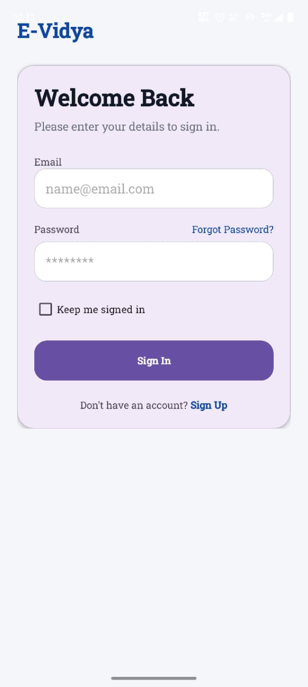
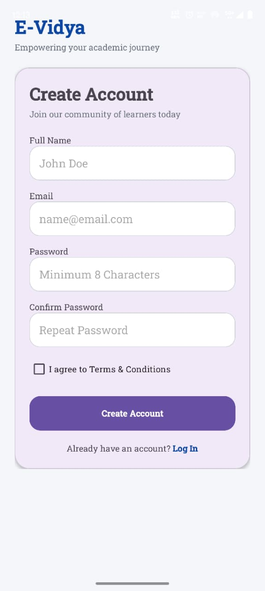
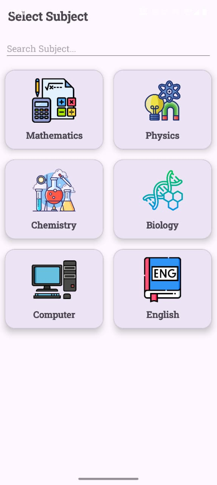
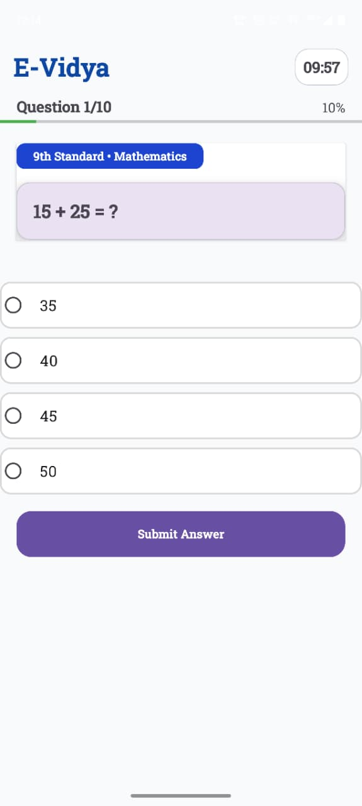
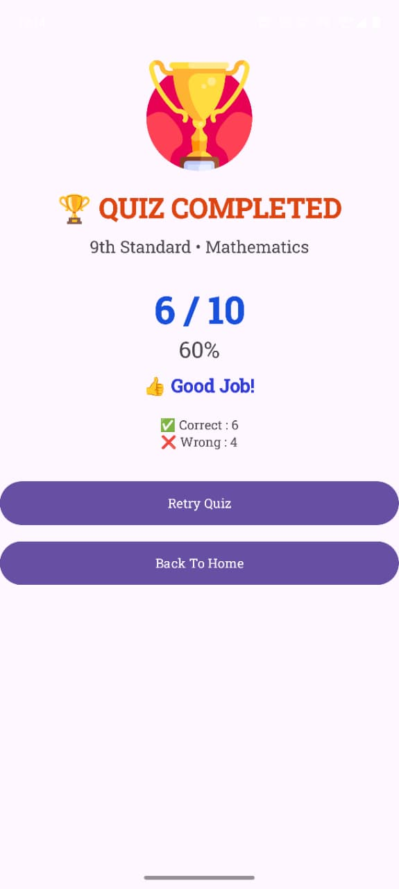
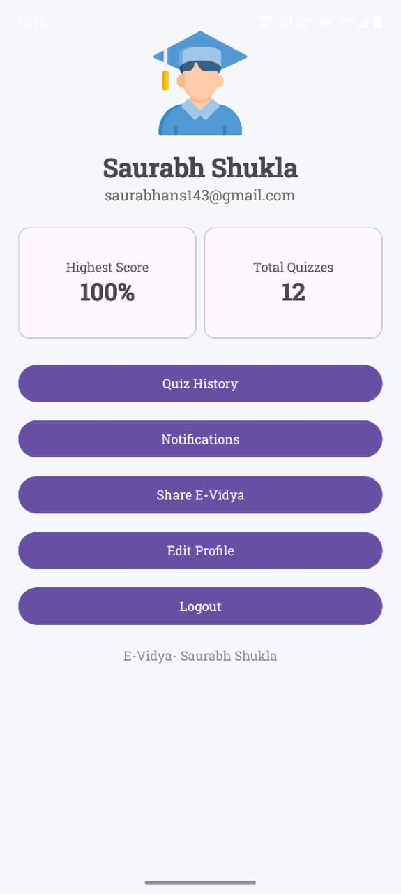
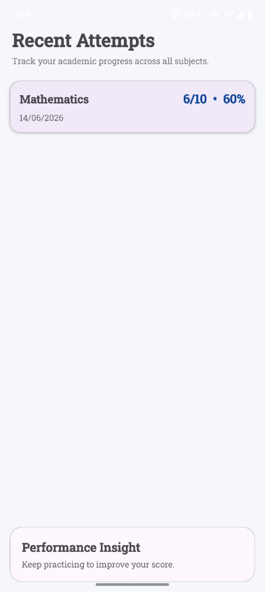

# E-Vidya 📚

An Android-based E-Learning Quiz Application developed using Kotlin and Firebase.

## Features

- User Registration & Login
- Firebase Authentication
- Forgot Password
- Profile Management
- Quiz History
- Random Quiz Questions
- Progress Tracking
- Timer Based Quiz
- Result Analytics
- Multiple Subjects
- Multiple Standards (9th–12th)

## Subjects

- Mathematics
- Physics
- Chemistry
- Biology
- Computer
- English

## Standards

- 9th Standard
- 10th Standard
- 11th Standard
- 12th Standard

## Technologies Used

- Kotlin
- Android Studio
- Firebase Authentication
- Firebase Firestore
- JSON
- RecyclerView
- Material Design

## Screenshots

### Splash Screen

### Login Screen

### Registration Screen

### Subject Selection

### Quiz Screen

### Result Screen

### Profile Screen

### History Screen

## Developed By

Saurabh Shukla

## Project Type

MCA Academic Project